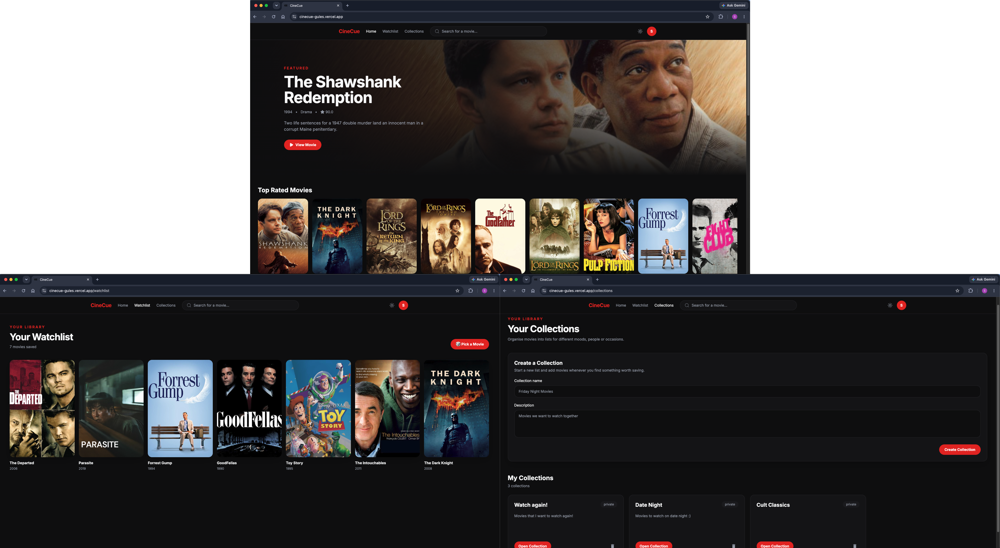
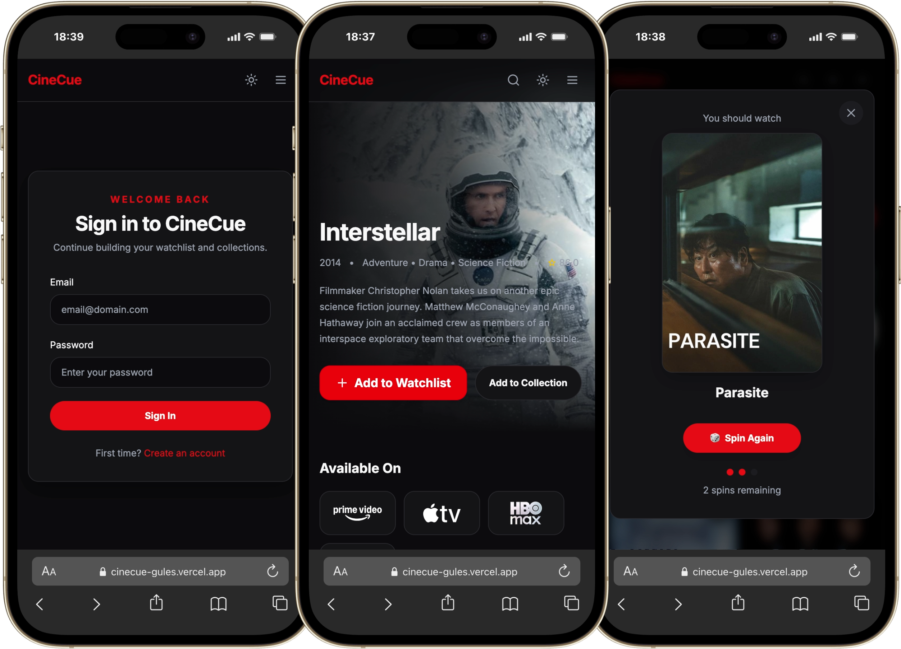
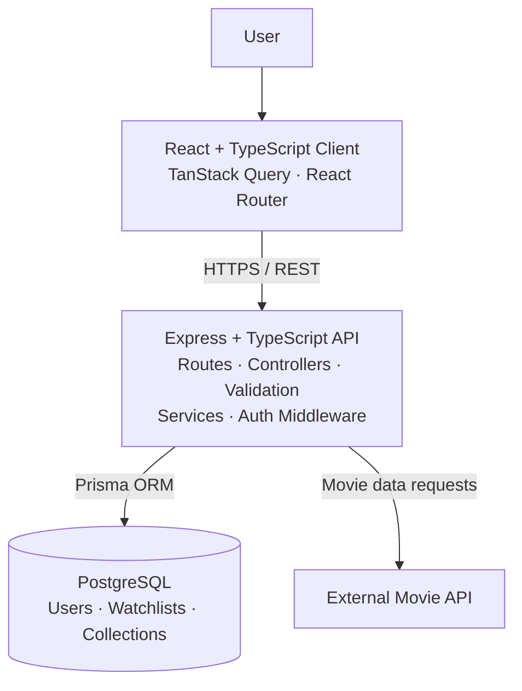

# 🎬 CineCue

### Find it. Save it. Spin it. Watch it.

CineCue is a full-stack movie discovery platform that helps users search for movies, check streaming availability, build personal watchlists and collections, and use the movie roulette when they can't decide what to watch.

Built with React, TypeScript, Express, PostgreSQL and Prisma.

[🚀 View Live Application](https://cinecue-gules.vercel.app/)

> **Note:** The API is hosted on Render's free tier, so the first request after a period of inactivity may take a little longer while the service starts.

---

## Screenshots

### Desktop



### Mobile



## Features

- **Movie Discovery** — Search for movies and explore detailed information including ratings, genres, release information and streaming availability.
- **Authentication** — Create an account and securely sign in with persistent cookie-based sessions.
- **Watchlist** — Save movies to a personal watchlist that persists across sessions.
- **Custom Collections** — Create named collections and organise saved movies into personalised lists.
- **Movie Roulette** — Randomly select a movie when you can't decide what to watch with a limited number of spins.
- **Streaming Availability** — View supported streaming services directly from individual movie pages.
- **Responsive Design** — Use CineCue across desktop and mobile layouts with responsive navigation and interfaces.
- **Light & Dark Themes** — Switch between light and dark application themes.

## Tech Stack

| Area               | Technologies                                                               |
| ------------------ | -------------------------------------------------------------------------- |
| **Frontend**       | React, TypeScript, Vite, Tailwind CSS, TanStack Query, React Router, Axios |
| **Backend**        | Node.js, Express, TypeScript                                               |
| **Database**       | PostgreSQL, Prisma ORM                                                     |
| **Authentication** | JWT, HTTP-only cookies, bcrypt                                             |
| **Testing**        | Vitest, React Testing Library, Jest, Supertest                             |
| **Infrastructure** | Docker, Docker Compose, Nginx                                              |
| **CI**             | GitHub Actions                                                             |
| **Deployment**     | Vercel, Render                                                             |

## Architecture

CineCue uses a React frontend backed by an Express API, with PostgreSQL and Prisma for persistence. External movie data is requested through the backend rather than directly from the client.



## Engineering Highlights

- JWT authentication using HTTP-only access and refresh-token cookies.
- Feature-based React architecture with TanStack Query for server state.
- Layered Express backend using routes, controllers, services, repositories and validation.
- Frontend and backend automated testing with Vitest, React Testing Library, Jest and Supertest.
- Docker Compose for the local stack and GitHub Actions for automated test, lint and build checks.

## Running Locally

### Prerequisites

Before running CineCue locally, ensure you have:

- [Docker](https://www.docker.com/) and Docker Compose
- A valid API key for the configured movie-data provider

### 1. Clone the repository

```bash
git clone git@github.com:Sind96/CineCue.git
cd CineCue
```

### 2. Configure the environment

Create local environment files from the provided templates:

```bash
cp .env.example .env
cp server/.env.example server/.env
cp client/.env.example client/.env
```

Update the generated files with your own credentials where required. Real credentials and secrets should not be committed.

### 3. Start CineCue

```bash
docker compose up --build
```

Docker Compose will start the frontend, backend and PostgreSQL database, and apply the required database migrations.

Once running:

- **Frontend:** `http://localhost:5173`
- **API:** `http://localhost:3000`
- **Health check:** `http://localhost:3000/health`

## Roadmap

CineCue's core MVP is complete and deployed. Planned improvements include:

- AI-powered movie discovery and recommendations
- Related movie recommendations
- Collection sharing
- Google sign-in

Additional improvements are tracked through [GitHub Issues](https://github.com/Sind96/CineCue/issues).

## Author

**Sindhu** — Full-Stack Developer
